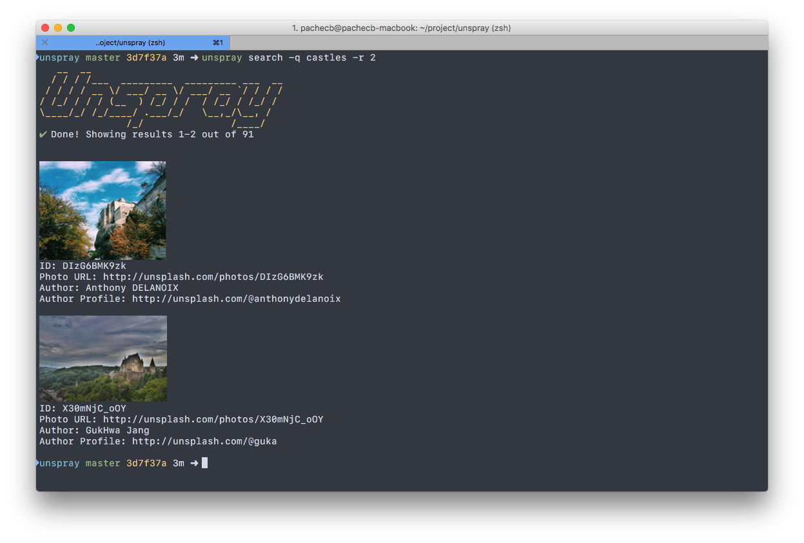

# Unspray

[](https://github.com/prettier/prettier)

A CLI for interacting with [Unsplash.com](https://unsplash.com)

## Installation
```
npm install -g unspray
```
or
```
yarn global add unspray
```

## Configuration
Create a `.unsprayrc` file in your home directory with your Unsplash.com Application ID. If you don't have an Application ID, you will need to create an Unsplash.com developer account and [register an application](https://unsplash.com/documentation#registering-your-application).
```
{
    "applicationID": "<YOUR_APPLICATION_ID_HERE>"
}
```

## Usage
There are 3 commands available in `unspray`

### Search
Search Unsplash.com for photos
```
unspray search -q "search query" -p 1 -r 5
```
##### Options
* `-q` or `--query` - Search query (required)
* `-p` or `--page` - Page number to retrieve (optional; default: 1)
* `-r` or `--results-per-page` - Number of items per page (optional; default: 10)

_Note: if you use iTerm2 v2.9+ you can see thumbnails of the results right in your terminal!_


### Save
Save a photo to your computer
```
unspray save -i "photo-id" -d "directory" -Q "quality"
```

##### Options
* `-i` or `--photo-id` - Photo ID (optional; if not provided, a random photo is retrieved)
* `-d` or `--directory` - A directory relative to your home directory (optional; default: Desktop)
* `-Q` or `--quality` - Quality of photo to save (`thumb`, `small`, `regular`, `full`). (optional;  default: `regular`)

### Set as wallpaper
Set a photo as your wallpaper
```
unspray set-wallpaper -i "photo-id" -d "directory" -Q "quality" -s "scale"
```

##### Options
* `-i` or `--photo-id` - Photo ID (optional; if not provided, a random photo is retrieved)
* `-d` or `--directory` - A directory relative to your home directory (optional; default: Desktop)
* `-Q` or `--quality` - Quality of photo to save (`thumb`, `small`, `regular`, `full`). (optional;  default: `regular`)
* `-s` or `--scale` - Scaling method to use for the wallpaper (`fill`, `fit`, `stretch`, `center`). (optional;  default: `fill`)
